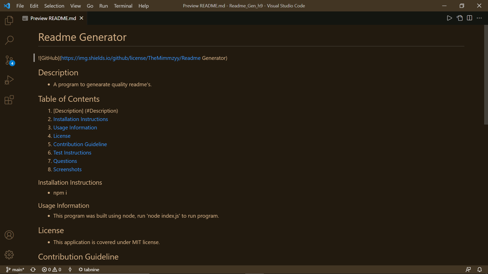
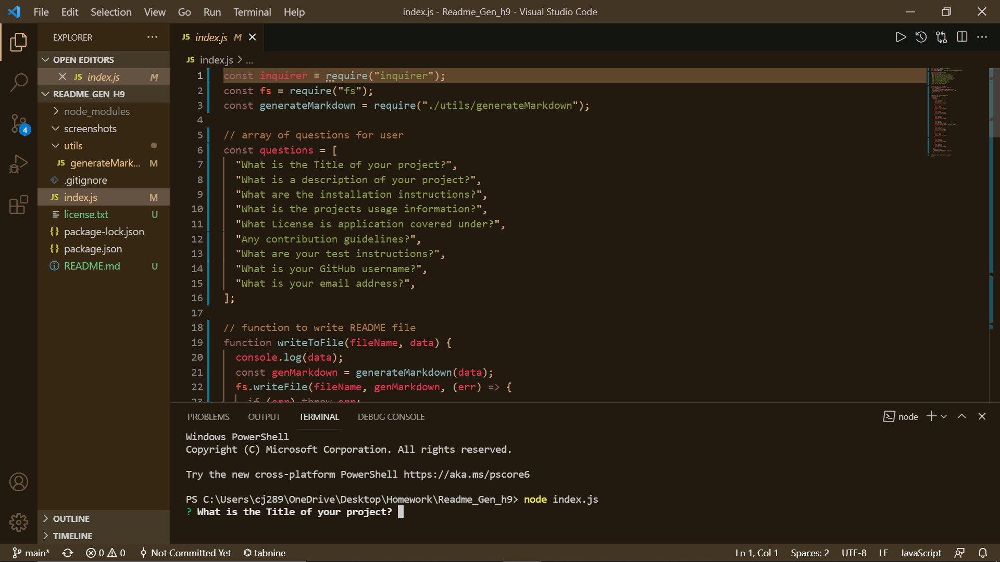

# Readme Generator
  
  ## Description 
  - A program to genearate quality readme's.
  ## Table of Contents
  1. [Description] (#Description)
  2. [Installation Instructions](#Installation)
  3. [Usage Information](#usage)
  4. [License](#license)
  5. [Contribution Guideline](#contributing)
  6. [Test Instructions](#test)
  7. [Questions](#questions)
  8. [Screenshots](#screenshots)
 
 
  ### Installation Instructions 
  - npm i
  ### Usage Information 
  - This program was built using node, run 'node index.js' to run program.
  ## License 
  - This application is covered under MIT license. 
  ## Contribution Guideline 
  - To contribute to this project, fork the repository and check for any errors.
  ## Test Instructions 
  - n/a
  ## Questions 
  Any questions? Please Contact Below
  - GitHub Link: 
  [TheMimmzyy](https://github.com/TheMimmzyy) 
  - Email: 
  cjc3481@gmail.com
  ## Screenshots 
  
  
  
